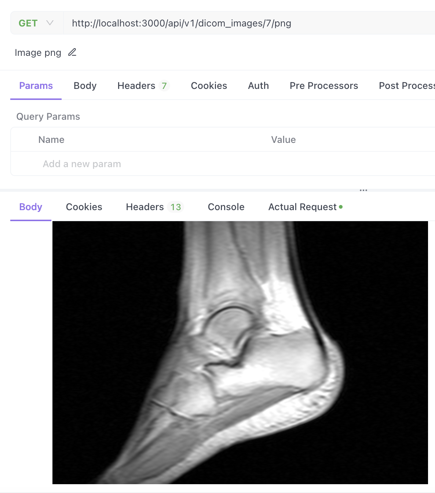
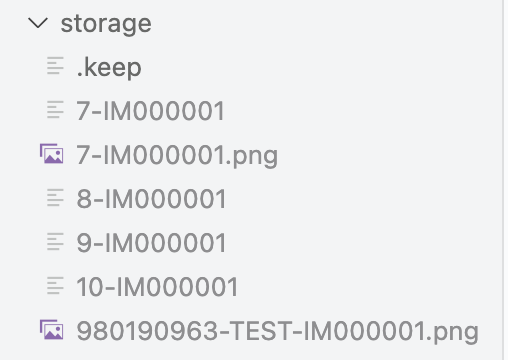

# README

~~I ran into issues with the library for converting the file into a PNG for browser-based viewing and ran out of time to debug, but it accepts the requests.~~

Update: works now!

Simple microservice that is able to:
- accept and store an uploaded DICOM file
- extract and return any DICOM header attribute based on a DICOM Tag as a query parameter
- convert the file into a PNG for browser-based viewing

Minor notes for reviewers:
- I tried to chunk the commits decently / indicate what was most relevant.
- Most of the relevant files are in `app/models`.

# Usage

## Set up

**Pre-requisite**: Need to be able to run Ruby / Rails programs.

To start the rails server in the terminal:
```
rails server
```

From there, you can make requests to localhost using curl / preferred api testing software.


## Requests supported

### POST /api/VERSION/dicom_images

Takes in a filename + a DICOM file via form-data and stores it locally.

Example inputs in Apidog:

<!--  -->


Curl version:

```
curl --location --request POST 'http://localhost:3000/api/v1/dicom_images' \
--header 'User-Agent: Apidog/1.0.0 (https://apidog.com)' \
--header 'Accept: */*' \
--header 'Host: localhost:3000' \
--header 'Connection: keep-alive' \
--header 'Content-Type: multipart/form-data; boundary=--------------------------519424285481715771289683' \
--form 'filename="IM000001"' \
--form 'raw=@"/Users/clairejanke/Downloads/IM000001"'
```

Example response:

```
{
    "filename": "IM000001",
    "id": 9,
    "dcm": {
        "File Meta Information Group Length": 204,
        "File Meta Information Version": null,
        "Media Storage SOP Class UID": "1.2.840.10008.5.1.4.1.1.4",
        "Media Storage SOP Instance UID": "1.3.12.2.1107.5.2.6.24119.30000013121716094326500000395",
        "Transfer Syntax UID": "1.2.840.10008.1.2.1",
        ...
    }
}
```

### GET /api/VERSION/dicom_images/:id/dicom_elements/?tag=XXXX,XXXX

Given an id for a DicomImage (returned upon creation of an image) and a tag, returns element corresponding to tag.

Example request:

`GET http://localhost:3000/api/v1/dicom_images/8/dicom_elements/?tag=0029,0010`

Example response:

```
{
    "Private": "SIEMENS CSA HEADER"
}
```

### GET api/VERSION/dicom_images/:id/png

~~Currently not functional, but~~

Update: works now!

<!--  -->


Given an id for a DicomImage, returns a png file (format defaulting to `application/octet-stream`).

Example request:

`GET http://localhost:3000/api/v1/dicom_images/7/png`


# Suggested future changes

## First priorities

- More thorough input validation
- Error codes / handling for if it's not valid Dicom, if the system was unable to store the file, etc.
- More unit tests (Update: added another simple one)
- ~~Versioning~~ (Update: complete)
- Clean up `storage` directories upon closing Rails server. For example, this is my editor right now:

<!--  -->


## Somewhat outside the scope of the assignment:

- Handling for fuzzy tag matching / returning multiple attributes
- Authentication / SSL
- Safeguards (eg throttling) in case someone sends too many requests
- Caching (eg png files and element attribute requests)

## If we wanted to expand scope of app's capabilities:

- additional CRUD methods for managing DicomImages. I kept them to a minimum to match the requested features for now.
